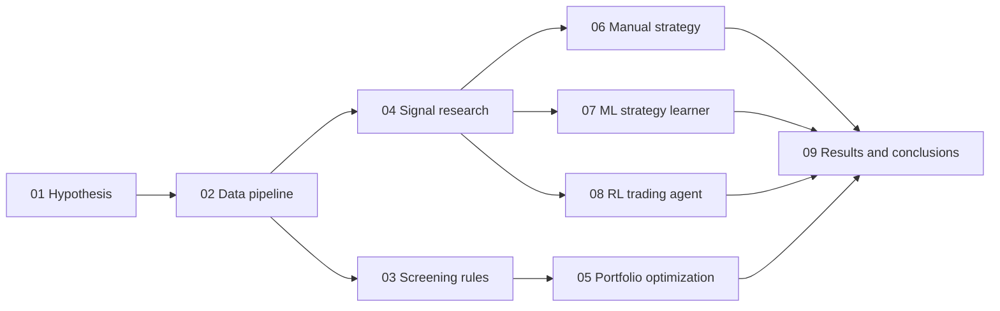
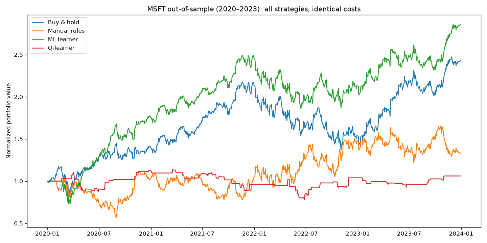

# Quant Research Lab

**An end-to-end data science / machine learning / AI research pipeline for equity markets** — from a testable hypothesis about alternative data, through data engineering, statistical inference, and rule-based screening, to cost-aware backtesting of manual, machine-learned, and reinforcement-learned trading strategies.

The point of this repo is not a magic strategy. It is the *discipline*: every claim is backed by a p-value, every strategy is judged out-of-sample, and every backtest pays transaction costs.

## The research story

> *Can alternative data and machine learning find — and exploit — an edge in equities?*



| # | Notebook | Question | Headline result |
|---|----------|----------|-----------------|
| 01 | [Hypothesis and research design](notebooks/01_hypothesis_and_research_design.ipynb) | Does Glassdoor "Positive Business Outlook" correlate with long-run ROI? | **Reject H₀** (p ≈ 1e-10, n = 548) — but r² ≈ 0.07: a screening factor, not a signal |
| 02 | [Data pipeline](notebooks/02_data_pipeline.ipynb) | How is the data extracted, cleaned, and versioned? | One tested loading path for scraped 2020 fundamentals + cached yfinance prices |
| 03 | [Screening rules](notebooks/03_screening_rules.ipynb) | Can explicit rules compress the universe? | 8 auditable rules cut ~1,170 companies to a **15-name** list (AAPL, MSFT, NVDA...) |
| 04 | [Signal research](notebooks/04_signal_research.ipynb) | Do technical indicators predict forward returns? | Mean-reversion ICs are consistent but tiny (\|IC\| < 0.1) — costs will matter |
| 05 | [Portfolio optimization](notebooks/05_portfolio_optimization.ipynb) | How much of each name to hold? | Max-Sharpe (SLSQP) beats SPY out-of-sample, but its in-sample edge decays |
| 06 | [Manual strategy backtest](notebooks/06_backtesting_manual_strategy.ipynb) | Can hand-tuned indicator rules beat buy & hold? | Not on a bull ticker, once costs are charged |
| 07 | [ML strategy learner](notebooks/07_ml_strategy_learner.ipynb) | Can from-scratch bagged random trees do better? | Best out-of-sample Sharpe (1.02) — validated by walk-forward analysis |
| 08 | [RL trading agent](notebooks/08_rl_trading_agent.ipynb) | Can a Q-learner learn a policy directly from P&L? | Learns a sensible low-risk policy; too coarse to beat the benchmark |
| 09 | [Results and conclusions](notebooks/09_results_and_conclusions.ipynb) | What holds up under identical evaluation? | Scorecard below; in-sample results flatter *every* method |
| 10 | [ABIDES market simulation](notebooks/10_abides_market_simulation.ipynb) | Can an EMA + inventory agent trade in a discrete-event market? | Vendored kernel + testable momentum/inventory logic |
| 11 | [Assess learners](notebooks/11_assess_learners.ipynb) | How do leaf size, bagging, and tree type affect error? | Small leaves overfit; bagging helps; RT faster than DT |
| 12 | [Martingale and grid-world RL](notebooks/12_martingale_and_gridworld.ipynb) | What do capped bankrolls and maze Q-learning teach? | Finite bankroll → negative EV; mazes learn goal-seeking policies |

Full narrative (first implementation vs after improvements, embedded charts, business-use framing, and Glassdoor/stock screening): **[docs/RESEARCH_REPORT.md](docs/RESEARCH_REPORT.md)** ([LaTeX](docs/RESEARCH_REPORT.tex)).

## The final scorecard

All strategies: MSFT, out-of-sample **2020–2023**, $100k starting cash, unlevered position sizing, $1 commission + 0.1% market impact per fill. Models trained strictly on 2016–2019.

| Strategy | Cumulative return | Sharpe | Max drawdown | Final value |
|----------|------------------:|-------:|-------------:|------------:|
| **ML learner** (bagged random trees) | **+185.4%** | **1.02** | **−27.0%** | **$285,412** |
| Buy & hold | +143.0% | 0.85 | −37.2% | $242,714 |
| Manual rules | +33.1% | 0.38 | −45.4% | $133,046 |
| Q-learner | +6.1% | 0.17 | −31.4% | $106,103 |



The honest caveats live in [notebook 09](notebooks/09_results_and_conclusions.ipynb): single symbol, one out-of-sample window, simple cost model, and walk-forward analysis shows the ML edge is not consistent year to year.

## What's inside

```
quant-research-lab/
├── src/quantlab/          # installable, typed, unit-tested package
│   ├── data/              # yfinance loader w/ local cache; fundamentals cleaning
│   ├── stats/             # sample sizing, Spearman scans, regression w/ verdicts
│   ├── screening/         # the 8-rule investment screen (rule engine)
│   ├── indicators/        # SMA, EMA, Bollinger %B, momentum, volatility
│   ├── backtest/          # market simulator (commission + impact) and metrics
│   ├── learners/          # trees, bagging, linear regression, InsaneLearner
│   ├── strategies/        # manual, ML, theoretically optimal
│   ├── rl/                # tabular Q-learner + trading env + grid worlds
│   ├── portfolio/         # Sharpe-maximizing SLSQP allocation
│   ├── sim/               # martingale / probability experiments
│   ├── experiments/       # learner assessment + best-for-* data
│   └── abides_agent/      # EMA momentum + inventory logic (ABIDES-ready)
├── notebooks/             # research story 01–12 (executed where noted)
├── data/                  # fundamentals/Glassdoor snapshots; learners; gridworlds
├── third_party/abides/    # optional agent-based market simulator
├── tests/                 # pytest unit tests
└── docs/                  # RESEARCH_REPORT.md/.tex/.pdf, figures, archive
```

Skills demonstrated, by layer:

- **Research design & statistics** — hypothesis formulation, Cochran sample sizing, Spearman rank scans with p-values, OLS with explicit reject/fail-to-reject verdicts, survivorship-bias and correlation-vs-causation caveats (01).
- **Data engineering** — web-scraped alternative data (archived scraper), messy-CSV cleaning (placeholder tokens, mixed flags, typos), canonical typed loaders, deterministic local price caching (02).
- **Quant finance** — screening rule engines, technical indicators, information coefficients, Sharpe/drawdown analytics, transaction cost modeling, portfolio optimization (03–06).
- **Machine learning** — regression trees and bootstrap-aggregated ensembles implemented from scratch in numpy, cost-aware trade thresholds, walk-forward validation, overfitting diagnosis (07).
- **Reinforcement learning** — tabular Q-learning with quantile-binned state design, costs inside the reward, policy inspection (08).
- **Engineering craft** — src-layout package, type hints, 48 unit tests, reproducible executed notebooks.

## Getting started

```bash
git clone https://github.com/kchebs/quant-research-lab.git
cd quant-research-lab
python3 -m venv .venv && source .venv/bin/activate
pip install -e ".[dev]"
# optional: pip install -e ".[abides]"
pytest            # unit tests
jupyter lab notebooks/
```

Notebooks 01–03 run fully offline from the committed snapshots. Price-based notebooks (03–09) download daily data once via `yfinance` into `data/prices/` and run offline afterward. Notebooks 10–12 cover ABIDES, learner assessment, martingale, and grid-world RL.

## Data

- `data/2020_09.csv`, `data/2020_11.csv`, `data/2020_12.csv` — monthly fundamentals + Glassdoor-outlook snapshots assembled in 2020 (Morningstar scrape + manual enrichment). Static research artifacts.
- `data/prices/` — auto-populated adjusted daily OHLCV cache from Yahoo Finance (gitignored).
- `docs/archive/` — the original 2020 scraper notebook and notes, kept for provenance.

## Disclaimer

Educational and personal research only. Nothing here is investment advice; the backtests have known limitations documented in notebook 09.

## License

All Rights Reserved. See [LICENSE](LICENSE).
