# Quant Research Lab — Research Report

This report is the single narrative for the lab: alternative-data stock
screening, probability and learner diagnostics, market simulation, technical
indicators, rule-based and machine-learned trading strategies, reinforcement
learning, and agent-based market simulation.

**How to read the sections.** Where results evolved, each block is labeled:

- **First implementation / first test / initial results** — original design and metrics
- **After improvements / updated results** — re-runs on the current package,
  data protocol, and evaluation discipline

Where useful: *X was tested and Y was received before improvements were made.*

Figures are embedded inline from [`docs/img/`](img/) and [`docs/img/report/`](img/report/).
Executable detail is in [`notebooks/`](../notebooks/).

**Formats:** Markdown ([`RESEARCH_REPORT.md`](RESEARCH_REPORT.md)) and LaTeX
([`RESEARCH_REPORT.tex`](RESEARCH_REPORT.tex); compile with `xelatex RESEARCH_REPORT.tex`).

**Disclaimer.** Educational and personal research only. Nothing here is investment
advice; known limitations are documented in §12.

---

## Abstract

Can alternative data and machine learning find — and exploit — an edge in
equities once transaction costs and out-of-sample evaluation are taken
seriously? This lab answers that question end-to-end: a Glassdoor outlook factor
is statistically real but weak ($p \approx 10^{-10}$, $r^2 \approx 0.07$);
eight auditable rules compress ~1,170 names to a ~15-name diligence list;
mean-reversion indicators carry tiny information coefficients ($|\mathrm{IC}| < 0.1$);
and under identical cost-aware evaluation on MSFT (train 2016-2019, OOS
2020-2023, $100k start, $1 commission + 0.1% impact), a bagged random-tree
learner posts the best headline scorecard (**+185.4%** cum return, Sharpe
**1.02**, max drawdown **−27%**) versus buy-and-hold (**+143%**, Sharpe 0.85).
Walk-forward yearly checks show that ML edge is **not** year-consistent. The
durable product of the work is therefore the evaluation discipline itself:
in-sample results flatter every method; only cost-aware, walk-forward comparison
is trustworthy.

| Strategy (MSFT OOS 2020-2023) | Cum. return | Sharpe | Max DD | Final value |
|---|---:|---:|---:|---:|
| ML learner (bagged random trees) | **+185.4%** | **1.02** | **−27.0%** | **$285,412** |
| Buy & hold | +143.0% | 0.85 | −37.2% | $242,714 |
| Manual rules | +33.1% | 0.38 | −45.4% | $133,046 |
| Q-learner | +6.1% | 0.17 | −31.4% | $106,103 |

---

## 1. Preface

**Research question.** Can alternative data and machine learning find — and
exploit — an edge in equities, once costs and out-of-sample evaluation are
taken seriously?

The pipeline grew from a fundamentals + Glassdoor screen into a cost-aware
backtesting lab with from-scratch learners and RL. Early trading experiments
used shorter crisis-era windows and fixed ±1000-share position caps. The
improved protocol standardizes on longer train/test splits, unlevered sizing,
walk-forward checks, and an installable `quantlab` package with unit tests.

---

## 2. Stock investment and Glassdoor alternative data

### 2.1 Goal

Develop a database and model for stock investment decisions by compiling
public-company information (fundamentals plus employee-sourced outlook) and
turning it into auditable screens and statistical tests.

### 2.2 Hypothesis

Does Glassdoor *Positive Business Outlook* correlate with long-run company ROI?

**First test.** On the 2020 research snapshots (Morningstar fundamentals joined
to Glassdoor outlook/rating), OLS and Spearman analysis rejected the null of no
association: **p ~ 1e-10** with **n ~ 548**, but **r² ~ 0.07**. Outlook behaves
like a *screening factor*, not a standalone trading signal.

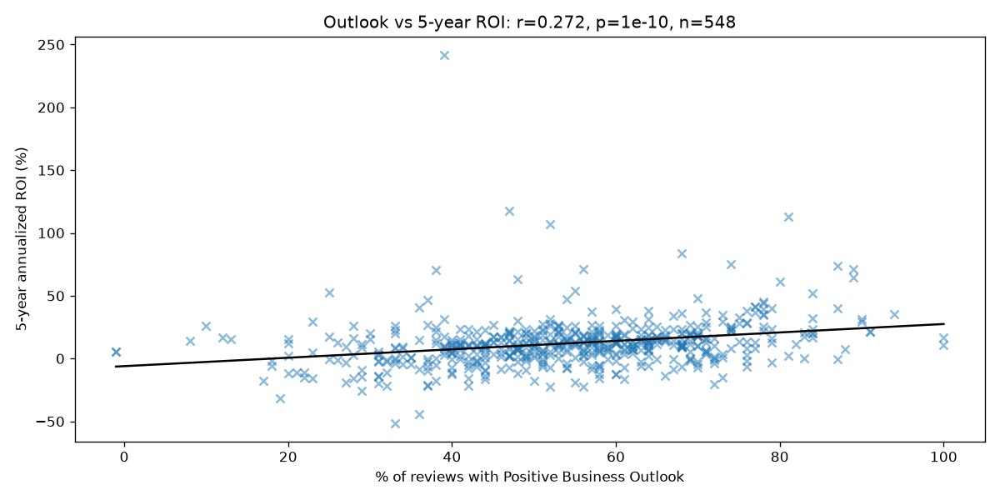

*Figure 2.1.* Glassdoor Positive Business Outlook (%) versus five-year ROI
($n \approx 548$). The association is statistically significant
($p \approx 10^{-10}$) but economically weak ($r^2 \approx 0.07$): useful as
one input among many, not as a trade trigger by itself.

Caveats recorded at the time:

- Associational look-back returns (not a true forward prediction study)
- Survivorship bias in the scraped universe
- No claim of post-2020 predictive validity
- Correlation is not causation

**After improvements.** The same hypothesis utilities live in `quantlab.stats`
(Cochran sample sizing, Spearman matrices with p-values, OLS with explicit
reject/fail-to-reject). Loaders in `quantlab.data.fundamentals` clean messy CSV
tokens, thousands separators, yes/no/ESG flags, and trend labels. Notebook
[`01_hypothesis_and_research_design.ipynb`](../notebooks/01_hypothesis_and_research_design.ipynb)
reproduces the verdict; provenance for the original scraper is under
[`docs/archive/`](archive/).

### 2.3 Data pipeline

**First implementation.** Web scraping assembled monthly fundamentals + outlook
tables (examples committed as `data/2020_09.csv`, `2020_11.csv`, `2020_12.csv`).

**After improvements.** A single tested loading path versions those snapshots;
prices come from Yahoo Finance with a deterministic local cache
(`quantlab.data.prices`). Notebook
[`02_data_pipeline.ipynb`](../notebooks/02_data_pipeline.ipynb).

### 2.4 Screening rules

**First test.** Eight auditable rules compressed roughly **1,170** names to about
a **15-name** list (e.g. AAPL, MSFT, NVDA):

1. Net income per employee >= $10,000  
2. Net profit margin > 2.57%  
3. 3-, 5-, and 10-year trailing ROI all > 10.1%  
4. Price shows an upward trend  
5. Glassdoor positive business outlook >= 60%  
6. Glassdoor overall rating >= 3.5  
7. PEG ratio between 0 and 1  
8. Beats S&P 500 over 1 year and 5 years  

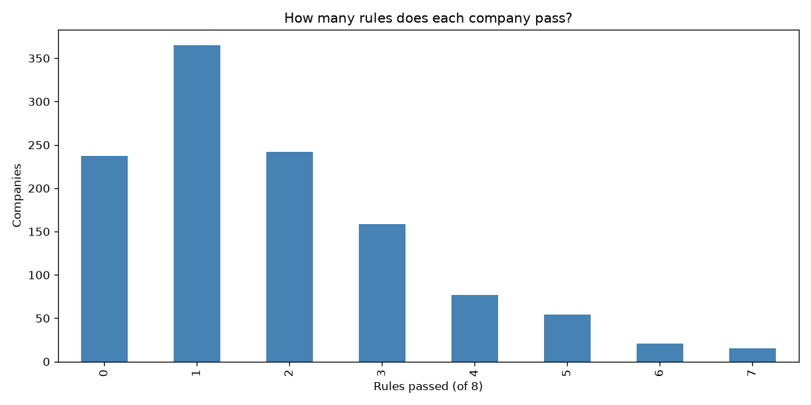

*Figure 2.2.* Distribution of how many of the eight rules each name passes.
Quality criteria are relatively common; the binding constraints are valuation
(PEG between 0 and 1) and beating the market over both one and five years —
cheap quality is rare.

**After improvements.** Rules are a typed engine in `quantlab.screening` with
unit tests; notebook [`03_screening_rules.ipynb`](../notebooks/03_screening_rules.ipynb).
Every pass/fail is inspectable. A hindsight check shows the 2020 top tier
(AAPL, MSFT, NVDA, and peers) went on to perform well, but that is one draw from
one period — whether rule sets like this hold under transaction costs is exactly
what the backtesting notebooks (06-08) test.

### 2.5 Practical / business use

**Alt-data diligence and universe compression.** A research or equity diligence
desk can treat Glassdoor outlook as one auditable screening input alongside
fundamentals — never as a standalone alpha signal. The eight-rule engine
compresses a large public universe into a short, inspectable shortlist for
deeper work (financial statement review, competitive analysis, position sizing).
Transparency matters: every reject reason is recorded, which supports compliance
review and reproducible research workflows.

---

## 3. Martingale (American roulette)

### 3.1 Abstract / setup

A martingale is a stochastic process where the expectation of the next value
equals the present value. Here the scenario is gambling: a gambler’s winnings
form a martingale if games are fair. The practical idea is that because you
cannot lose every time, you increase the stake after losses in anticipation of
a future win that recovers prior losses.

**Setup.** Always bet on black on an American roulette wheel (0 and 00): 38
pockets, 18 black => $P(\text{win}) = 18/38 \approx 47.7\%$. Double the stake
after each loss; quit at +$80 or after 1000 sequential bets.

Single-bet expected value (unit stake):

$$
\mathbb{E} = \tfrac{18}{38}(+1) + \tfrac{20}{38}(-1) \approx -\$0.05
$$

so the house edge is about five cents per dollar bet.

### 3.2 Experiment 1 — unlimited bankroll (first test)

**Estimated probability of winning $80 within 1000 bets.**  
All 1000 simulations achieved +$80 => estimated probability **100%**. Repeated
doubling with an unlimited bank account always recovers to the prior high and
then freezes at the +$80 target.

**Estimated expected value after 1000 bets.**  
Because every path hits +$80 and freezes, the mean terminal value across
simulations is **$80**. Equivalently: the path is a sequence of geometric
progressions ending in a win that reverses losses, then quitting at the target.

**Do mean ± SD lines reach a maximum then stabilize / converge?**  
Yes. Once equity freezes at $80, standard deviation -> 0, so mean, mean+SD, and
mean−SD stabilize and **converge**. SD rises then falls as more paths lock in.

Median ± SD plots behave similarly under the unlimited-bankroll freeze.

### 3.3 Experiment 2 — $256 bankroll cap (first test)

**Estimated probability of winning $80 within 1000 bets.**  
666 of 1000 simulations succeeded => **66.6%**. The capital cap blocks recovery
after a deep losing streak. With single-spin win rate ~ 47.7%, more trials would
be expected to push this estimate somewhat lower.

**Estimated expected value after 1000 bets.**  
Paths converge near +$80 (~66.6%) or −$256 (~33.3%):

$$
0.666 \times 80 + 0.334 \times (-256) \approx -\$34.53
$$

If hit rate falls with more trials, EV becomes more negative.

**Do mean ± SD lines converge?**  
No. First-test plateaus were roughly: mean+SD ~ $126.24, mean ~ −$32.22,
mean−SD ~ −$190.69, with SD ~ $158.46. Because a large mass remains at −$256,
SD never approaches 0 and the bands **do not converge**.

### 3.4 After improvements

Clean API in `quantlab.sim.martingale` with seeded RNG. Re-run (200 sims, seed
42) via `scripts/generate_report_assets.py`:

| Setting | Hit rate | Expected terminal |
|---|---:|---:|
| Unlimited | 1.00 | 80.0 |
| Cap $256 | 0.63 | ~ −44.3 |

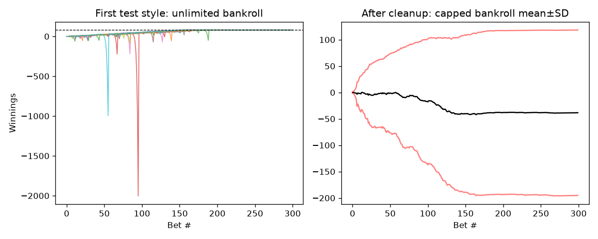

*Figure 3.1.* Unlimited-bankroll paths reach +$80 and freeze (left); with a $256
cap, mean ± SD bands do not converge because a large mass of paths sits at the
ruin level (right). Frequent small wins coexist with negative expected value
under capital limits.

Conclusions match the first test (sure win with infinite capital; negative EV
with a finite bankroll). Differences vs 1000-sim first-test figures are Monte
Carlo noise. Notebook
[`12_martingale_and_gridworld.ipynb`](../notebooks/12_martingale_and_gridworld.ipynb).

### 3.5 Practical / business use

**Risk and probability education.** The martingale is a clean demonstration for
risk committees and trading trainees: a strategy can show a high hit rate and
still destroy capital once bankroll, leverage, or position limits bind. Any
proposal that “wins most of the time” must still be judged on expected value and
drawdown under realistic capital constraints — the same discipline applied later
to trading strategies with impact costs.

---

## 4. Portfolio optimization

### 4.1 Method

Maximize the Sharpe ratio of a long-only, fully invested portfolio with SciPy
SLSQP. Daily returns of the weighted book are used; the objective is typically
minimizing the negative Sharpe.

### 4.2 First implementation

**Parameters**

| Parameter | Value |
|---|---|
| Start | 2008-06-01 |
| End | 2009-06-01 |
| Symbols | JPM, GLD, X, IBM |

**Optimizer / portfolio results (first test)**

| Metric | Value |
|---|---:|
| Current function value | −0.026653247 |
| Iterations | 7 |
| Function evaluations | 42 |
| Gradient evaluations | 7 |
| Allocations | ~ [1, 0, 0, 0] (100% JPM) |
| Sum of allocations | 1.00 |
| Sharpe ratio | −1.0939 |
| Average daily return | 0.0018367 |
| Cumulative return | −0.1148 |

The original write-up listed “volatility” as −0.02665; that number is the
optimizer’s objective value (negative Sharpe under the maximize-Sharpe formulation),
not the standard deviation of daily returns.

Normalized optimal portfolio vs S&P 500 was plotted for the crisis window. The
takeaway: in-sample “optimal” weights in a crash do not imply a good absolute
outcome — here the Sharpe-maximizing book was essentially all JPM and still
lost money.

### 4.3 After improvements

Notebook [`05_portfolio_optimization.ipynb`](../notebooks/05_portfolio_optimization.ipynb)
uses train **2016-2019** / OOS **2020-2023**, often on the screened universe,
benchmarked to SPY and equal weight (`quantlab.portfolio`). The optimizer
concentrates into assets with the best historical risk-adjusted returns — that
is what maximizing in-sample Sharpe *means*, and it is also why the allocation
is fragile. Out-of-sample the optimized book still competes well, but the gap to
equal-weight narrows as past covariance structure decays.

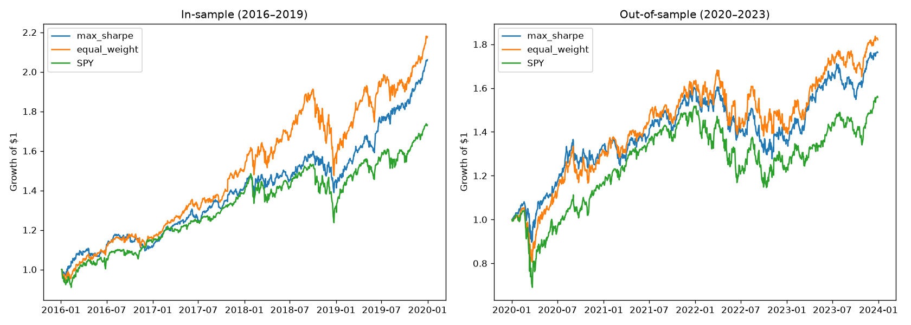

*Figure 4.1.* Normalized equity curves for max-Sharpe, equal-weight, and SPY on
the modern out-of-sample window. Max-Sharpe can beat the benchmarks, but the
in-sample edge does not fully persist — the same lesson as the crisis-era first
test under a healthier evaluation protocol.

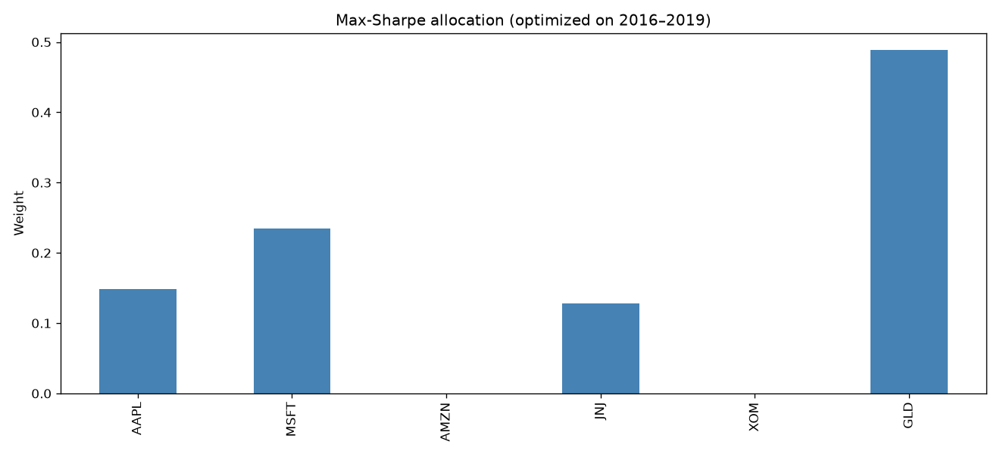

*Figure 4.2.* Optimized weights under the max-Sharpe objective. Concentration
into a few names is expected behavior of unconstrained Sharpe maximization and
is a reason to impose diversification priors (weight bounds) in production.

### 4.4 Practical / business use

**Portfolio construction as a tilt engine.** Use the optimizer to propose
*tilts* relative to a diversified prior — not to quote in-sample Sharpe as a
forward expectation. Practical controls include weight caps, turnover budgets,
and a strict optimize-on-train / judge-on-test split. That same split discipline
is reused for every strategy in §§6-9.

---

## 5. Assess learners

### 5.1 Abstract and introduction

Compare from-scratch learners that accept tabular (non-time-series) inputs and
return continuous predictions: **decision tree**, **random tree**, **bag**,
**InsaneLearner**, and **linear regression**. Primary metric: RMSE. Later
experiments also use MAE and wall-clock time.

**Initial hypotheses (first test):**

1. Increasing leaf size decreases overfitting but increases error.  
2. Decision trees take longer than random trees but are more accurate, because
   they choose splits by correlation rather than at random.

### 5.2 Methods

Data: `Istanbul.csv` (also accepted: any similar numeric matrix). Shuffle, then
**60%** train / **40%** test. Leaf sizes swept **1-100** where relevant. Bagging
defaults to **20** bags and can wrap any base learner.

Split rule: decision trees pick the feature with highest absolute correlation
with the target and split at the median; random trees pick a random feature.

### 5.3 Experiment 1 — leaf size vs overfitting (decision tree)

Overfitting means fitting training data so closely that the model fails on new
data. Gauge it by **in-sample vs out-of-sample RMSE**.

Smaller leaf size => deeper trees => more overfit. The smallest in/out RMSE *gap*
occurred near **leaf size ~ 21**; at that point and smaller, overfit was visible.
Larger leaves constrain depth and improve generalization.

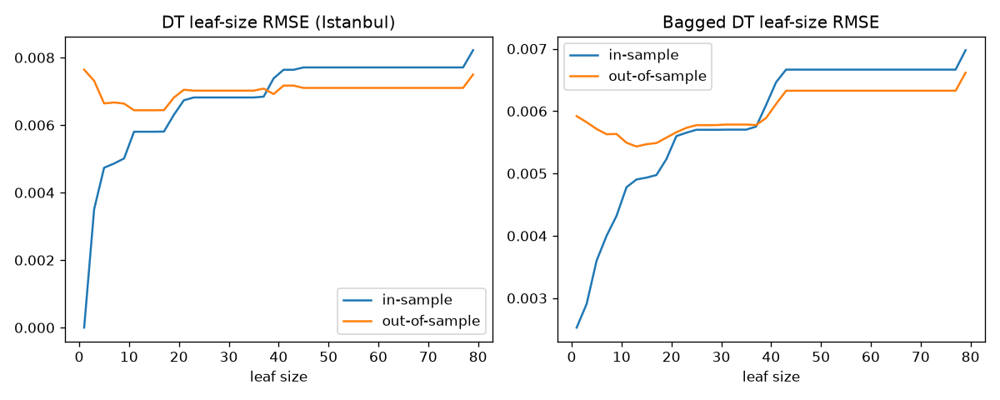

*Figure 5.1.* In-sample and out-of-sample RMSE versus leaf size for a decision
tree (and bagged variants where shown). Small leaves drive in-sample RMSE near
zero while out-of-sample error stays high — the classic overfit signature.
Bagging narrows the gap but does not eliminate the overfit region at very small
leaves.

### 5.4 Experiment 2 — bagging

Bagging draws bootstrap subsets, trains a learner per bag, and averages
predictions to reduce variance. With 20 bags, RMSE fell at both low and high
leaf sizes relative to bare DT (e.g. leaves 10, 21, 81), and the in/out gap
shrank at very small leaves — bagging **reduces** overfit impact but does
**not** eliminate it (an overfit region remained for leaf size <= 81). Varying bag
count would not remove that region entirely.

### 5.5 Experiment 3 — decision tree vs random tree

Metrics: MAE and time to fit + query train and test $X$.

Expectation: RT less accurate, often less overfit-prone in practice as a weak
learner, and faster. First-test results: DT MAE generally better; RT up to
**~4× faster** at small leaves, with the gap narrowing as leaf size grows.
Bagged RTs inherit the speed advantage.

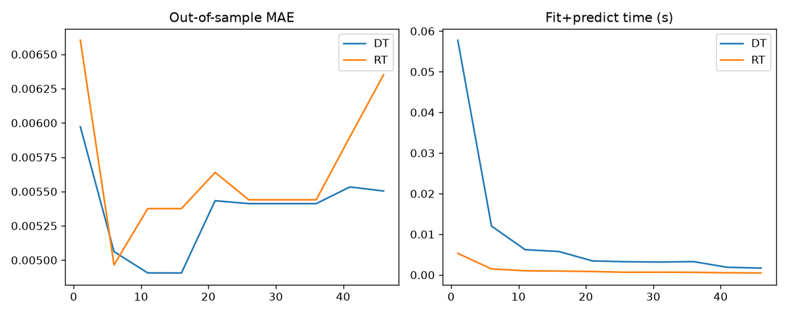

*Figure 5.2.* Accuracy versus wall-clock cost for decision trees and random
trees across leaf sizes. Decision trees win on MAE; random trees win on speed —
the tradeoff that motivates bagging random trees as weak learners in the
strategy section.

### 5.6 Non-experiment component — InsaneLearner

InsaneLearner = **20** bag learners, each a bag of **20** linear regressors
(400 linear models), implemented compactly. Linear regression uses least
squares with an intercept column.

### 5.7 First-test summary

Inverse relationship between leaf size and overfitting; RMSE gap diagnoses
overfit; bagging helps; DT vs RT is an accuracy/speed tradeoff; **no single
model wins everywhere**.

### 5.8 After improvements

Same experiments in `quantlab.experiments` + notebook
[`11_assess_learners.ipynb`](../notebooks/11_assess_learners.ipynb).

Synthetic **best-for-*** datasets (`quantlab.experiments.best4`): linear targets
favor OLS (near-zero RMSE vs large tree error); axis-aligned thresholds favor
trees — concrete proof that “best learner” depends on data geometry.

### 5.9 Practical / business use

**Model selection before deployment.** Before promoting a learner into a trading
pipeline, sweep capacity controls (leaf size), measure in-sample vs OOS error,
and prefer bagging when variance dominates. Match model class to data geometry:
linear structure favors OLS; discontinuous thresholds favor trees. Choosing the
wrong inductive bias wastes compute and produces fragile strategies — the same
lesson resurfaces when bagged trees outperform hand rules in §9.

---

## 6. Market simulator

### 6.1 First implementation

Order-file simulator: dated BUY/SELL rows with symbol and share count; mark
portfolio value daily. Cost model: flat **commission** per fill and fractional
**impact** (buys pay more, sells receive less).

Typical early strategy settings: commission ~ **$9.95**, impact **0.005**,
positions in {−1000, 0, +1000}, start cash **$100,000**.

### 6.2 After improvements

- `quantlab.backtest.run_backtest` — single-asset trade series  
- `quantlab.backtest.run_orders` — multi-symbol order logs  
- Metrics: Sharpe, max drawdown, cumulative/avg daily return, volatility  

Default research costs in later notebooks: **$1 commission + 0.1% impact**, with
**unlevered** share caps via `affordable_shares`.

### 6.3 Practical / business use

**Cost-aware strategy R&D.** Any strategy evaluated at zero costs should be
assumed broken for decision-making. The simulator is the gate that research
desks use to promote or kill ideas: identical commission, impact, cash, and
sizing assumptions across manual, ML, and RL candidates. Impact grids (notebook
06) show performance degrading as slippage rises — weak edges disappear first.

---

## 7. Indicators and theoretically optimal strategy

Charts historically used **adjusted close normalized to 1.0** at the start of
the window. Implementations live in `quantlab.indicators`.

### 7.1 Simple moving average (SMA)

SMA is the arithmetic mean of the last $n$ prices:

```text
prices.rolling(n).mean()
```

It smooths noise and lags price. Traders watch short SMA crossing above long
SMA as a possible uptrend start (and the reverse for downtrend).

**First test:** $n \in \{20, 50\}$ on JPM; multiple 20/50 crosses over ~2 years;
20 above 50 interpreted as upward trend.

### 7.2 Bollinger Bands

Upper/lower bands at SMA ± (width × rolling standard deviation). First test:
$n = 20$, width = 2.

- **Squeeze** (bands close): low recent vol; often precedes a vol expansion, but
  does not by itself give direction or timing.  
- Price near lower band: often read as oversold; near upper: overbought. Bands
  alone are not sufficient trading signals (Bollinger’s own guidance).  

**%B / band value** locates price relative to the bands. First-test plots scaled
the band value (÷10) for readability; late-2009 showed bands tightening
(falling SD).

### 7.3 Momentum

Leading rate-of-change vs price $n$ periods ago (first test: $n = 20$):

$$
\text{momentum}_t = \frac{P_t}{P_{t-n}} - 1
$$

Positive => bullish momentum. Crossing up through zero after being below does
not prove a downtrend is over — only that it is slowing. First-test figure:
momentum spiked after the ~2009-04 trend reversal.

### 7.4 Exponential moving average (EMA)

EMA weights recent prices more heavily:

1. Seed with SMA  
2. Multiplier $= 2/(N+1)$  
3. $\mathrm{EMA}_t = P_t \cdot m + \mathrm{EMA}_{t-1}\cdot(1-m)$  

```text
prices.ewm(...).mean()
```

First test used 20- and 50-day EMA; 20 crossing above 50 as a buy cue. EMA
crosses can lag differently than SMA crosses on the same chart.

### 7.5 Volatility

Dispersion of returns; higher vol => wider range of outcomes (riskier in that
sense). First indicator study used **7-day** rolling std of daily returns
(×2 for display); strategy work often used **20-day**. High vol early-2009
coincided with the large downtrend. Risk-averse traders may refuse to trade
when vol is extreme; others combine high vol with trend direction as a signal.

### 7.6 Signal research (after improvements)

Notebook [`04_signal_research.ipynb`](../notebooks/04_signal_research.ipynb)
measures information coefficients (Spearman rank correlation of each factor
versus five-day forward return). **%B and price/SMA are consistently
negative-IC**: stretched prices tend to revert over the next week — that
motivates the mean-reversion tilt of the manual strategy in §9. The edge is
tiny: $|\mathrm{IC}| < 0.1$. ICs of a few percent only become tradable when
aggregated across many decisions and when costs are modeled honestly.
Indicators are computed strictly from past prices (rolling windows, no centered
windows), so nothing leaks future information.

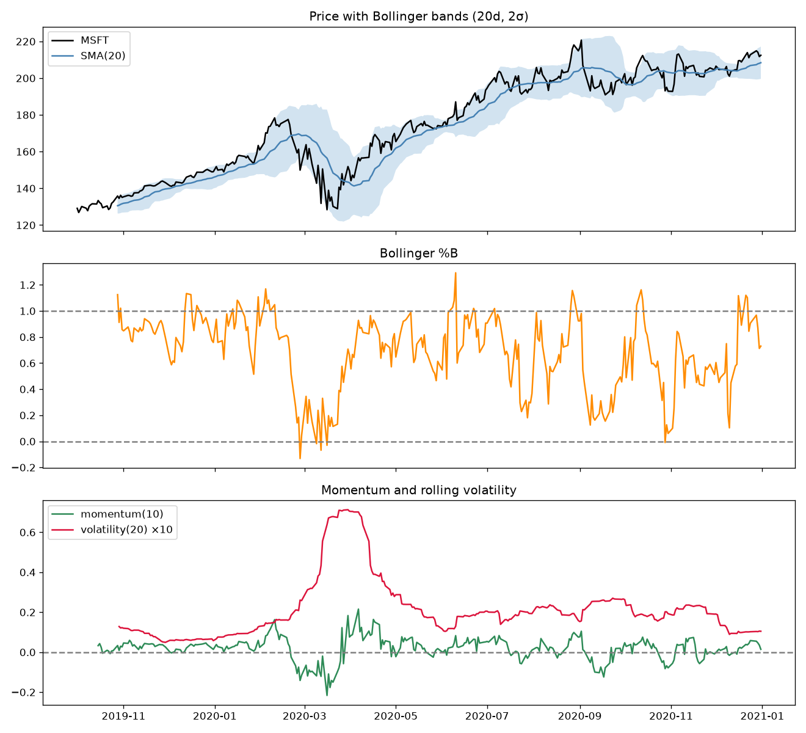

*Figure 7.1.* Indicator panel on MSFT: price with SMA/EMA overlays, Bollinger
%B, momentum, and volatility. These trailing-window features are the shared
feature set for manual and ML strategies.

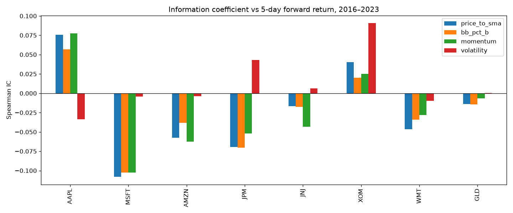

*Figure 7.2.* Spearman information coefficients versus five-day forward return
across tickers and factors. Mean-reversion features are directionally consistent
but economically small — costs will dominate any naive trading rule built on
them alone.

### 7.7 Theoretically optimal strategy (TOS)

**Assumptions.** Perfect foresight of tomorrow’s close; no bankroll limit;
trades at adjusted close; at most one trade/day; positions in {−1000, 0, +1000};
**zero** commission and impact.

**Construction (first test).** Mark each day +1/−1 by whether the next close is
higher/lower. When that sign flips, trade to flip between long and short (share
deltas up to ±2000 while net holdings stay in {−1000, 0, +1000}).

**Window:** JPM, 2008-01-01 -> 2009-12-31, $100,000 start.

**Benchmark:** buy 1000 shares day one and hold (normalized to 1.0).

**First-test performance**

| Metric | TOS | Benchmark |
|---|---:|---:|
| Sharpe ratio | 13.3228 | 0.1569 |
| Cumulative return | 5.7861 | 0.0123 |
| Stdev of daily returns | 0.0045 | 0.0170 |
| Average daily return | 0.0038 | 0.0002 |
| Final value | $678,610 | $101,230 |

Benchmark stayed relatively flat; TOS trended strongly upward — an upper bound,
not a tradable policy.

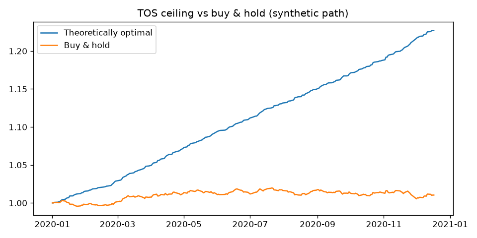

*Figure 7.3.* Theoretically optimal strategy versus buy-and-hold under perfect
foresight and zero costs. The gap is the ceiling real strategies must approach
after frictions — not a target they can hit.

**After improvements.** `theoretically_optimal_trades` in `quantlab.strategies`;
notebook 06 uses it as a ceiling.

### 7.8 Practical / business use

**Signal research and capacity budgeting.** Indicator ICs set expectations for
how much edge exists before costs. A desk that sees $|\mathrm{IC}| < 0.1$
should budget for low turnover, tight impact assumptions, and aggregation across
names — not high-frequency single-name churn. TOS frames the *maximum*
frictionless P&L so stakeholders do not confuse a research ceiling with a
deployable strategy.

---

## 8. Q-learning

### 8.1 First test — grid worlds

Tabular Q-learning (optional **Dyna** replay) on discrete mazes
(`data/gridworlds/`). Actions: N/E/S/W. Rewards: step penalty, large penalty for
pits, positive reward at goal. The agent learns a path from start to goal.

### 8.2 After improvements — trading application

Same `QLearner` drives `TradingEnvironment`: quantile-binned indicators +
position in the state; reward = position × next return − impact. Notebook
[`08_rl_trading_agent.ipynb`](../notebooks/08_rl_trading_agent.ipynb).

On a bull-market training window the agent discovers a mostly-long policy — a
reasonable lesson, honestly learned, but it means the agent is effectively
long-biased going into 2020’s crash. Tabular RL with quantile-binned indicators
is transparent (every state’s preferred action is inspectable) but coarse; it
cannot interpolate between states the way the tree ensemble does. Because the
reward includes an impact penalty, the agent learns not to churn — switching
costs sit inside the learning loop, not only in evaluation.

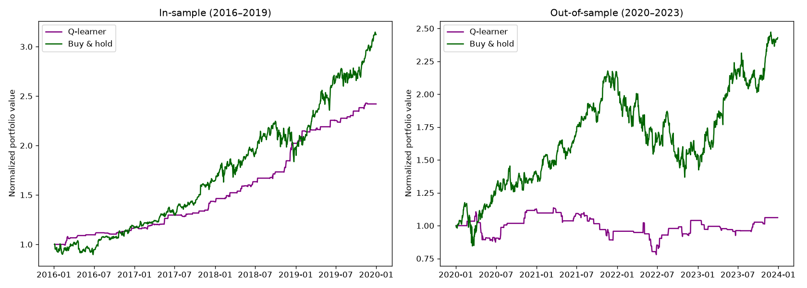

*Figure 8.1.* Q-learner equity versus buy-and-hold on the modern MSFT evaluation
window. The policy is conservative and low-churn but too coarse to beat the
benchmark out-of-sample under the current state design.

Notebook [`12_martingale_and_gridworld.ipynb`](../notebooks/12_martingale_and_gridworld.ipynb)
keeps maze training available. Natural extensions (Dyna-style replay for sample
efficiency; function approximation / DQN for richer states) are listed in §12.

### 8.3 Practical / business use

**Policy learning with costs inside the loop.** Tabular Q-learning is a
transparent prototype for execution or inventory policies where every state-
action pair must be auditable. Embedding impact in the reward teaches low
turnover automatically. For production-scale state spaces, the business path is
function approximation (DQN) — still under the same cost-aware evaluation gate.

---

## 9. Strategy evaluation

**Initial hypothesis (first test):** Manual Strategy beats Benchmark
**in-sample**; Strategy Learner beats Manual.

### 9.1 Indicators used for strategies

Same family as §7 (SMA 20/50, Bollinger $n=20$, width 2, momentum 20,
volatility 20-day ×2 for display/signals). Prices forward- then back-filled and
normalized to 1.0 at start for the first-test charts.

### 9.2 Manual strategy — creation and signals (first implementation)

**Windows:** in-sample 2008-01-01 -> 2009-12-31; out-of-sample 2010-01-01 ->
2011-12-31. Symbol JPM. Holdings constrained to {−1000, 0, +1000}.

Actions sum component votes: sum > 0 => buy, sum < 0 => sell, 0 => flat. Multiple
indicators hedge single-indicator failure and allow trading vs pure hold.

**+1 / buy** when any of:

1. 20-day SMA crosses **above** 50-day SMA (today above, yesterday below).  
2. Price crosses **above** the lower Bollinger band (today above, yesterday below).  
3. Momentum crosses **above** zero (today > 0, yesterday < 0, with the prior-day
   stability check used in the first implementation).  

**−1 / sell** when any of:

1. 20-day SMA crosses **below** 50-day SMA.  
2. Price crosses **below** the upper Bollinger band.  
3. Momentum crosses **below** zero (symmetric to the buy rule).  

Example: votes (+1, −1, 0) sum to 0 => no trade.

### 9.3 Manual vs benchmark — first-test performance

In-sample: Manual beat Benchmark (as designed). Out-of-sample: Manual **worse**
than Benchmark — thresholds tuned on in-sample did not transfer. “Past
performance doesn’t guarantee future performance.”

| Metric | Manual (In) | Bench (In) | Manual (Out) | Bench (Out) |
|---|---:|---:|---:|---:|
| Sharpe | 0.188 | 0.153 | −1.4569 | −0.2636 |
| Cumulative return | 0.034 | 0.01 | −0.3847 | −0.0853 |
| Stdev daily return | 0.0151 | 0.017 | 0.00997 | 0.0085 |
| Avg daily return | 0.000179 | 0.00016 | −0.0009 | −0.00014 |
| Number of trades | 41 | 2 | 40 | 2 |
| Final value | $103,340.80 | $100,819.25 | $61,517.55 | $91,273.10 |

Extra trades explain in-sample outperformance vs a static hold; the same
activity hurt out-of-sample.

### 9.4 Strategy learner (first implementation)

**Features:** same indicators as Manual (incl. 20/50 SMA ratio, Bollinger %B,
momentum, volatility). **Target:** 5-day percent return, discretized to
{−1, 0, +1} with thresholds that include impact. Missing features filled with 0.

**Model:** BagLearner of Random Trees — **20 bags**, **leaf size 6** (larger leaf
to limit degradation). Train 2008-2009; test 2010-2011.

### 9.5 Experiment 1 — Manual vs Learner vs Benchmark (first test)

Commission **9.5**, impact **0.005**, $100k start, ±1000 shares, fixed RNG seed.

Hypothesis: Learner beats Manual — **supported** in- and out-of-sample vs Manual.
Out-of-sample, **Benchmark still beat the Learner**; all three finished below
start in that OOS window. Without a seed, RT bags would not reproduce exactly;
other OOS windows might change rankings.

**In-sample table (first test)**

| Metric | Strategy Learner | Manual | Benchmark |
|---|---:|---:|---:|
| Sharpe | 3.6 | 0.188 | 0.153 |
| Cumulative return | 1.816 | 0.034 | 0.01 |
| Stdev daily return | 0.009 | 0.0151 | 0.017 |
| Avg daily return | 0.0021 | 0.000179 | 0.00016 |
| Number of trades | 117 | 41 | 2 |
| Final value | $281,056.30 | $103,340.80 | $100,819.25 |

In-sample, the Learner had the best return and Sharpe with the **lowest** daily
vol while trading the **most** — classic in-sample success that did not fully
carry OOS against buy-and-hold.

### 9.6 Experiment 2 — impact sensitivity (first test)

Commission **0**; impacts **0, 0.002, 0.004, 0.006**. Hypothesis: larger impact =>
lower final value (impact is a cost). Generally true for cum return / avg daily
return / final value; not perfectly monotone at tiny impact steps because of
random trees. Higher impact tended to reduce Sharpe. At impact ~ 0.02, trades
became minimal; high enough impact can yield **no** trades.

**In-sample impact table (first test)**

| Impact | 0 | 0.002 | 0.004 | 0.006 |
|---|---:|---:|---:|---:|
| Sharpe | 3.676 | 3.857 | 3.901 | 3.535 |
| Cumulative return | 1.92 | 2.023 | 2.043 | 1.776 |
| Stdev daily | 0.00938 | 0.00921 | 0.00916 | 0.0093 |
| Avg daily return | 0.00217 | 0.00223 | 0.00225 | 0.00207 |
| Number of trades | 93 | 109 | 103 | 112 |
| Final value | $292,030 | $302,036 | $303,881 | $276,948 |

### 9.7 After improvements — modern protocol and scorecard

**Protocol.** Symbol **MSFT**; train **2016-2019**; OOS **2020-2023**; $100k
start; unlevered share sizing; **$1 commission + 0.1%** market impact per fill.
Manual rules use vote thresholds in `ManualRuleStrategy`; ML uses bagged random
trees in `MLTradingStrategy`. Everything the learner knows comes from four
trailing-window indicators (§7); richer features (cross-sectional fundamentals,
outlook) remain future work (§12).

The manual strategy trades the mean-reversion edge from §7.6. Whether it beats
buy-and-hold out-of-sample depends heavily on regime: a strong bull market is
hard for a partially-flat strategy to beat. Costs eat weak edges — impact sweeps
in notebook 06 show performance degrading monotonically with slippage.

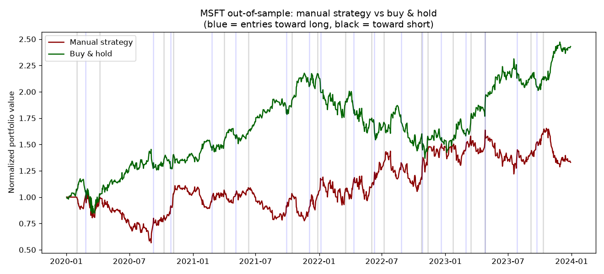

*Figure 9.1.* Manual rule strategy versus buy-and-hold under the modern
cost-aware protocol. Hand-tuned thresholds that looked reasonable in-sample
struggle on a bull ticker once costs are charged.

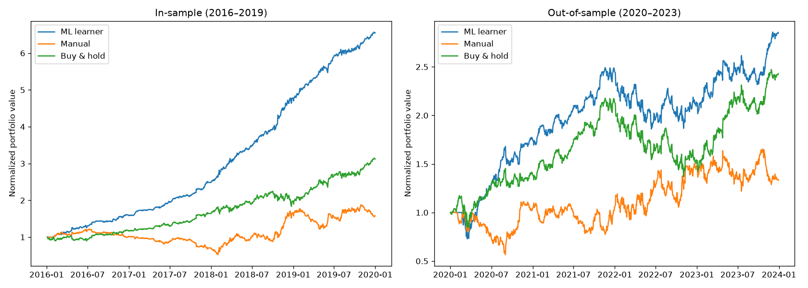

*Figure 9.2.* Bagged random-tree learner versus manual rules (and benchmark) on
the same features, costs, and date splits. The learner improves on hand rules,
but the gap between in-sample and out-of-sample performance remains the
headline: the model memorizes training-window patterns that only partially
persist.

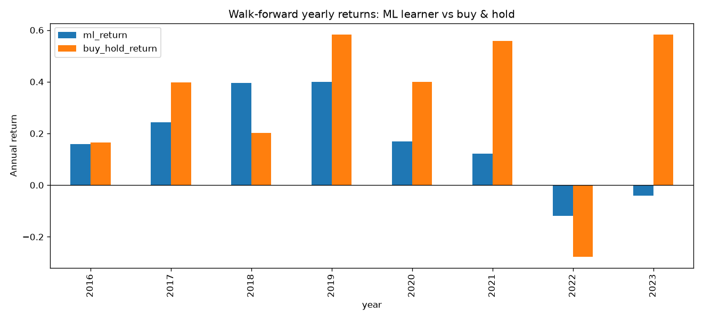

*Figure 9.3.* Year-by-year walk-forward comparison of ML versus buy-and-hold
(2016-2023 training/evaluation folds as implemented in notebook 07). The
learner’s edge over buy-and-hold is **inconsistent** year to year — exactly what
a small IC from §7.6 predicts. A single multi-year OOS window can flatter a
method that fails annual consistency checks.

**Modern OOS scorecard (MSFT, 2020-2023)**

| Strategy | Cumulative return | Sharpe | Max drawdown | Final value |
|---|---:|---:|---:|---:|
| ML learner (bagged random trees) | **+185.4%** | **1.02** | **−27.0%** | **$285,412** |
| Buy & hold | +143.0% | 0.85 | −37.2% | $242,714 |
| Manual rules | +33.1% | 0.38 | −45.4% | $133,046 |
| Q-learner | +6.1% | 0.17 | −31.4% | $106,103 |


*Figure 9.4.* Equity curves for all strategies under identical evaluation
assumptions. ML leads on cumulative return and Sharpe with a milder max
drawdown than buy-and-hold on this window — subject to the walk-forward caveat
in Figure 9.3.

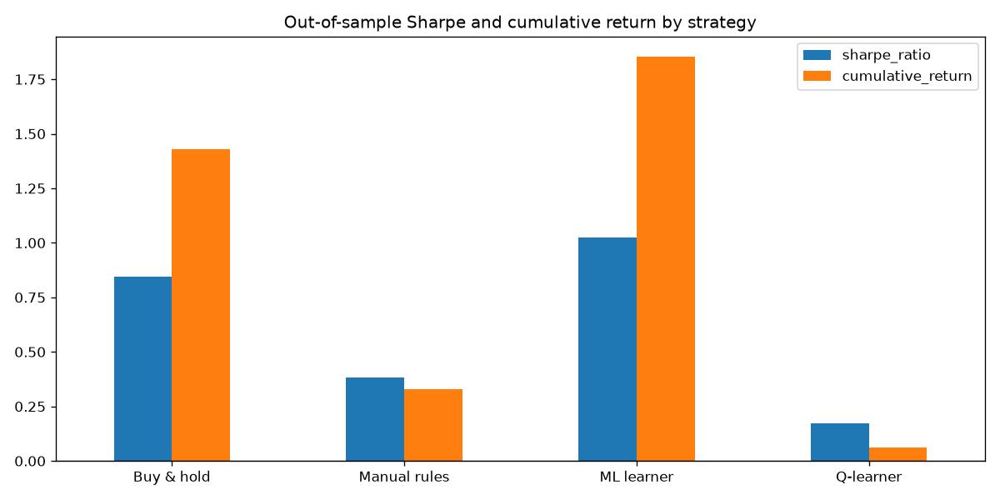

*Figure 9.5.* Bar summary of cumulative return, Sharpe, and max drawdown across
strategies. Ranking by any single metric can mislead; the full scorecard plus
walk-forward is the decision package.

**Reading the tension.** On the headline 2020-2023 MSFT window, ML beats
buy-and-hold. Walk-forward shows that edge is not year-consistent. Both facts
belong in any promotion decision: a research desk should require both a
favorable multi-year OOS scorecard *and* acceptable year-by-year behavior before
capital allocation.

### 9.8 Practical / business use

**Promotion gate for trading ideas.** Identical cost-aware evaluation —
commission, impact, cash, sizing, train/test splits — is the gate that decides
whether a manual rule, tree ensemble, or RL policy is promoted, iterated, or
killed. In-sample results systematically flatter every method; walk-forward and
impact sensitivity are the business controls that prevent over-commitment to a
fragile edge.

---

## 10. ABIDES market simulation

### 10.1 First implementation — agent design

Custom agent in the Agent-Based Interactive Discrete Event Simulation
environment (EMA mid-price momentum + inventory-aware quoting):

1. On wake: cancel resting orders; fetch spread / book.  
2. Compare fast vs slow mid-price EMAs -> buy / sell / flat momentum status.  
3. Size and price using depth-weighted mid estimates and recent bid-ask spread
   volatility; inventory skew raises bids when flat/cash-heavy and lowers asks
   when long.  
4. Place an order only when momentum and inventory logic agree; pause after
   fills to avoid over-leverage / order spam.  
5. Flatten within ~5 minutes of the close.

### 10.2 After improvements

Kernel vendored under [`third_party/abides/`](../third_party/abides/) (see
`PROVENANCE.md` and upstream LICENSE). Strategy logic also as testable pure
functions in `quantlab.abides_agent`. Notebook
[`10_abides_market_simulation.ipynb`](../notebooks/10_abides_market_simulation.ipynb)
and `quantlab.abides_runner` (`pip install -e ".[abides]"`). Close-to-close
backtests in §§6-9 remain the primary scorecard; ABIDES is the path to richer
fill, spread, and book realism called out as future work in §12.

### 10.3 Practical / business use

**Execution and microstructure R&D.** Close-to-close simulators understate
spread, queue position, and intra-day inventory risk. ABIDES lets a desk
prototype EMA + inventory agents against a discrete-event market — useful for
execution research, market-making sketches, and stress-testing policies that
look fine on daily bars but fail under realistic fills. Promote agents only
after unit-tested logic and, eventually, spread-aware evaluation.

---

## 11. Unified conclusions

1. **Glassdoor outlook** associates with historical ROI weakly (screening factor,
   not standalone alpha).  
2. **Finite-bankroll martingales** have negative expected value despite frequent
   small wins.  
3. **Learner choice** depends on leaf size, bagging, and data geometry.  
4. **TOS** shows how large a frictionless edge looks; real strategies must clear
   costs. Tiny indicator ICs set hard ceilings on capacity once impact is
   charged.  
5. **Hand rules** overfit short in-sample windows; **bagged trees** can beat
   buy-and-hold on a modern OOS window but fail walk-forward consistency.  
6. **Tabular RL** learns sensible low-risk behavior, not a benchmark-beating
   policy under the current state design.  
7. **ABIDES** remains the path for microstructure-style agent experiments.  
8. **Business takeaway.** The durable asset is the evaluation protocol —
   auditable screens, cost-aware simulation, and walk-forward honesty —
   not any single headline Sharpe.

---

## 12. Limitations and future work

### Limitations

- Single-symbol strategy tests; a cross-sectional (many-stock) portfolio
  strategy is the natural next step and would use the screening universe.  
- The fundamentals snapshot is a single 2020 vintage with survivorship bias.  
- Transaction cost model is simple (flat commission + linear impact); no
  borrow costs on shorts, no spread modeling.  
- No multiple-hypothesis correction across the indicator/strategy grid.  
- Walk-forward analysis shows the ML edge is not consistent year to year, even
  when the multi-year OOS scorecard looks favorable.

### Future work

- **Cross-sectional ML:** train the tree ensemble on the full screening
  universe with fundamentals + outlook + technicals as features.  
- **Deep RL:** replace the Q-table with a DQN to handle continuous state.  
- **Fresh alternative data:** re-acquire outlook via an official API and test
  the §2 hypothesis on post-2020 data as true out-of-sample.  
- **Execution realism:** spread-aware fills, volume participation limits, and
  fuller ABIDES experiments beyond the vendored kernel + unit-tested agent
  logic.

---

## References

1. Hayes, A. (2020, August 28). Bollinger Band®.
   https://www.investopedia.com/terms/b/bollingerbands.asp  
2. Hayes, A. (2020, September 10). Exponential Moving Average (EMA).
   https://www.investopedia.com/terms/e/ema.asp  
3. Hayes, A. (2020, September 22). Simple Moving Average (SMA) Definition.
   https://www.investopedia.com/terms/s/sma.asp  
4. Staff, I. (2020, August 28). Momentum Indicates Stock Price Strength.
   https://www.investopedia.com/articles/technical/081501.asp  
5. Woods, G. (2019, September 26). Trading with the Bollinger Band Squeeze.
   https://www.tradingsetupsreview.com/bollinger-squeeze/  
6. Byrd, D., Hybinette, M., & Balch, T. *ABIDES: Towards High-Fidelity Market
   Simulation for AI Research*. arXiv:1904.12066.
